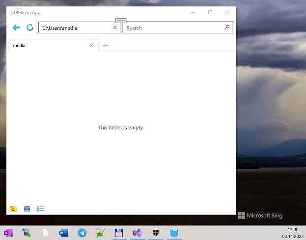

# FEApp
My fork based on [Tunip3/FEApp](https://github.com/tunip3/FEApp) and [Osaxely/ExtendedStorage](https://github.com/Osaxely/ExtendedStorage).

## About
FEApp = Special File Explorer app (UWP edition; min. os. build: 16299 at now)
ExtendedStorage is free library for managing files in UWP apps. FEApp based contains ExtendedStorage library for smart file "manipulations".

## Screenshots

## Description of Extended Storage Library
The Extended Storage library allows developers of UWP apps to access every file of the system. Extended Storage allows the following features:

Full access to the filesystem (Including hidden and operating system files) on any UWP device.
Writing and reading files.
Opening files in stream for further manipulations.
Archive system for Creation/Extraction.
Access to the external storage drives.
It is as easy to use as Windows.Storage API.
This powerful library was developed by myself and tunip3.

Additional details
In order to use that library, your app must declare the following capabilities:

runFullTrust
broadFileSystemAccess
Samples
These few samples show some simple features of that powerful library. A bunch of other features can be done such as Copying/Moving/Deleting or opening as a stream.

Getting a file and a folder

using ExtendedStorage;

using ExtendedStorage.Utils;

...

// Get a folder from path and a file from folder

EStorageFolder folder = EStorageFolder.GetFromPath(FOLDER_PATH); // Returns null if the folder was not found.

EStorageFile textFile = folder.GetFile("sample.txt"); // Get file from that folder, also returns null if the file was not found.

// Get a folder from another folder

EStorageFolder folder = EStorageFolder.GetFromPath(FOLDER_PATH);

EStorageFolder anotherFolder = folder.GetFolder("Other");

// Getting a file

EStorageFile file = EStorageFile.GetFromPath(FILE_PATH);

Reading a text file

That example assumes that we have a text file called sample.txt which contains Hello world.

using ExtendedStorage;

using ExtendedStorage.Utils;

...

EStorageFolder folder = EStorageFolder.GetFromPath(FOLDER_PATH); // Returns null if the folder was not found.

EStorageFile textFile = folder.GetFile("sample.txt"); // Get file from that folder, also returns null if the file was not found.

string content = textFile.ReadText(); // Read all the text.

System.Diagnostics.Debug.WriteLine($"File content: {content}");

Output: File content: Hello world

Writing to a text file

using ExtendedStorage;

using ExtendedStorage.Utils;

...

EStorageFolder folder = EStorageFolder.GetFromPath(FOLDER_PATH); // Returns null if the folder was not found.

EStorageFile textFile = folder.GetFile("sample.txt"); // Get file from that folder, also returns null if the file was not found.

textFile.WriteText("Hello world"); // Read all the text.

## Referenes
- https://github.com/tunip3/FEApp/
- https://github.com/Osaxely/FEApp/

## ..
AS IS. No support! RnD mode.

## .
[m][e] 2022

